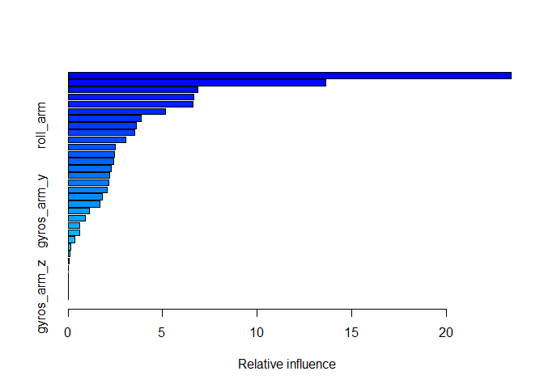
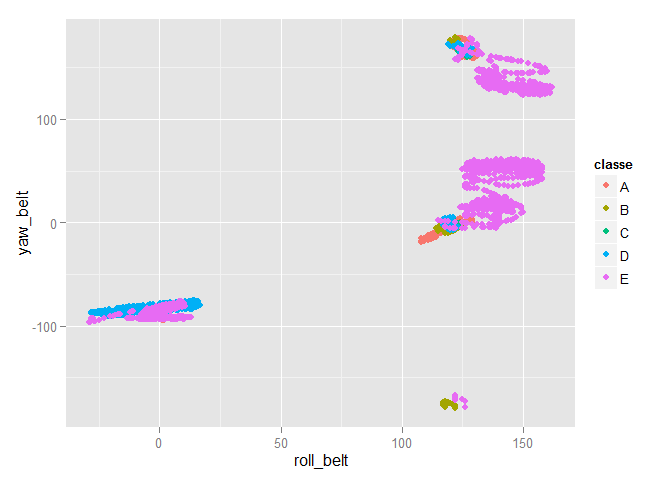
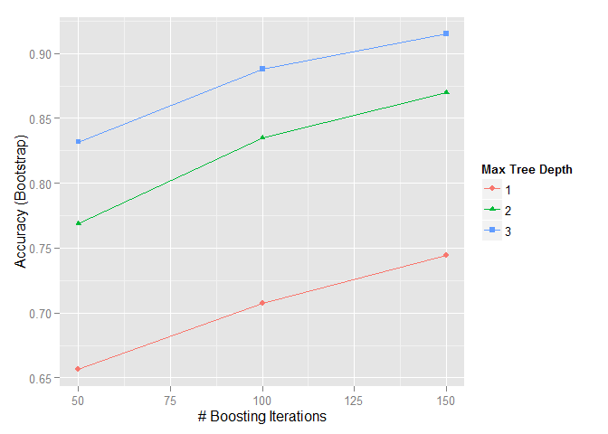

# An Exercise in Machine Learning
November 21, 2015  

#Synopsis  

Using monitoring devices such as Jawbone Up, Nike FuelBand, and Fitbit allows the user to collect a large amount of data about personal activity. These devices are used to regularly quantify how much of a particular activity done; however, they rarely quantify *how well* the activity was completed. In this project, the goal is to use data from accelerometers on the belt, forearm, arm, and dumbell of 6 participants who were asked to perform barbell lifts correctly and incorrectly in 5 different ways and predict the manner in which they did the exercise using the "classe" variable in the training dataset. 


Read in the data: 


```
## 'data.frame':	19622 obs. of  160 variables:
##  $ X                       : int  1 2 3 4 5 6 7 8 9 10 ...
##  $ user_name               : Factor w/ 6 levels "adelmo","carlitos",..: 2 2 2 2 2 2 2 2 2 2 ...
##  $ raw_timestamp_part_1    : int  1323084231 1323084231 1323084231 1323084232 1323084232 1323084232 1323084232 1323084232 1323084232 1323084232 ...
##  $ raw_timestamp_part_2    : int  788290 808298 820366 120339 196328 304277 368296 440390 484323 484434 ...
##  $ cvtd_timestamp          : Factor w/ 20 levels "02/12/2011 13:32",..: 9 9 9 9 9 9 9 9 9 9 ...
##  $ new_window              : Factor w/ 2 levels "no","yes": 1 1 1 1 1 1 1 1 1 1 ...
##  $ num_window              : int  11 11 11 12 12 12 12 12 12 12 ...
##  $ roll_belt               : num  1.41 1.41 1.42 1.48 1.48 1.45 1.42 1.42 1.43 1.45 ...
##  $ pitch_belt              : num  8.07 8.07 8.07 8.05 8.07 8.06 8.09 8.13 8.16 8.17 ...
##  $ yaw_belt                : num  -94.4 -94.4 -94.4 -94.4 -94.4 -94.4 -94.4 -94.4 -94.4 -94.4 ...
##  $ total_accel_belt        : int  3 3 3 3 3 3 3 3 3 3 ...
##  $ kurtosis_roll_belt      : Factor w/ 397 levels "","-0.016850",..: 1 1 1 1 1 1 1 1 1 1 ...
##  $ kurtosis_picth_belt     : Factor w/ 317 levels "","-0.021887",..: 1 1 1 1 1 1 1 1 1 1 ...
##  $ kurtosis_yaw_belt       : Factor w/ 2 levels "","#DIV/0!": 1 1 1 1 1 1 1 1 1 1 ...
##  $ skewness_roll_belt      : Factor w/ 395 levels "","-0.003095",..: 1 1 1 1 1 1 1 1 1 1 ...
##  $ skewness_roll_belt.1    : Factor w/ 338 levels "","-0.005928",..: 1 1 1 1 1 1 1 1 1 1 ...
##  $ skewness_yaw_belt       : Factor w/ 2 levels "","#DIV/0!": 1 1 1 1 1 1 1 1 1 1 ...
##  $ max_roll_belt           : num  NA NA NA NA NA NA NA NA NA NA ...
##  $ max_picth_belt          : int  NA NA NA NA NA NA NA NA NA NA ...
##  $ max_yaw_belt            : Factor w/ 68 levels "","-0.1","-0.2",..: 1 1 1 1 1 1 1 1 1 1 ...
##  $ min_roll_belt           : num  NA NA NA NA NA NA NA NA NA NA ...
##  $ min_pitch_belt          : int  NA NA NA NA NA NA NA NA NA NA ...
##  $ min_yaw_belt            : Factor w/ 68 levels "","-0.1","-0.2",..: 1 1 1 1 1 1 1 1 1 1 ...
##  $ amplitude_roll_belt     : num  NA NA NA NA NA NA NA NA NA NA ...
##  $ amplitude_pitch_belt    : int  NA NA NA NA NA NA NA NA NA NA ...
##  $ amplitude_yaw_belt      : Factor w/ 4 levels "","#DIV/0!","0.00",..: 1 1 1 1 1 1 1 1 1 1 ...
##  $ var_total_accel_belt    : num  NA NA NA NA NA NA NA NA NA NA ...
##  $ avg_roll_belt           : num  NA NA NA NA NA NA NA NA NA NA ...
##  $ stddev_roll_belt        : num  NA NA NA NA NA NA NA NA NA NA ...
##  $ var_roll_belt           : num  NA NA NA NA NA NA NA NA NA NA ...
##  $ avg_pitch_belt          : num  NA NA NA NA NA NA NA NA NA NA ...
##  $ stddev_pitch_belt       : num  NA NA NA NA NA NA NA NA NA NA ...
##  $ var_pitch_belt          : num  NA NA NA NA NA NA NA NA NA NA ...
##  $ avg_yaw_belt            : num  NA NA NA NA NA NA NA NA NA NA ...
##  $ stddev_yaw_belt         : num  NA NA NA NA NA NA NA NA NA NA ...
##  $ var_yaw_belt            : num  NA NA NA NA NA NA NA NA NA NA ...
##  $ gyros_belt_x            : num  0 0.02 0 0.02 0.02 0.02 0.02 0.02 0.02 0.03 ...
##  $ gyros_belt_y            : num  0 0 0 0 0.02 0 0 0 0 0 ...
##  $ gyros_belt_z            : num  -0.02 -0.02 -0.02 -0.03 -0.02 -0.02 -0.02 -0.02 -0.02 0 ...
##  $ accel_belt_x            : int  -21 -22 -20 -22 -21 -21 -22 -22 -20 -21 ...
##  $ accel_belt_y            : int  4 4 5 3 2 4 3 4 2 4 ...
##  $ accel_belt_z            : int  22 22 23 21 24 21 21 21 24 22 ...
##  $ magnet_belt_x           : int  -3 -7 -2 -6 -6 0 -4 -2 1 -3 ...
##  $ magnet_belt_y           : int  599 608 600 604 600 603 599 603 602 609 ...
##  $ magnet_belt_z           : int  -313 -311 -305 -310 -302 -312 -311 -313 -312 -308 ...
##  $ roll_arm                : num  -128 -128 -128 -128 -128 -128 -128 -128 -128 -128 ...
##  $ pitch_arm               : num  22.5 22.5 22.5 22.1 22.1 22 21.9 21.8 21.7 21.6 ...
##  $ yaw_arm                 : num  -161 -161 -161 -161 -161 -161 -161 -161 -161 -161 ...
##  $ total_accel_arm         : int  34 34 34 34 34 34 34 34 34 34 ...
##  $ var_accel_arm           : num  NA NA NA NA NA NA NA NA NA NA ...
##  $ avg_roll_arm            : num  NA NA NA NA NA NA NA NA NA NA ...
##  $ stddev_roll_arm         : num  NA NA NA NA NA NA NA NA NA NA ...
##  $ var_roll_arm            : num  NA NA NA NA NA NA NA NA NA NA ...
##  $ avg_pitch_arm           : num  NA NA NA NA NA NA NA NA NA NA ...
##  $ stddev_pitch_arm        : num  NA NA NA NA NA NA NA NA NA NA ...
##  $ var_pitch_arm           : num  NA NA NA NA NA NA NA NA NA NA ...
##  $ avg_yaw_arm             : num  NA NA NA NA NA NA NA NA NA NA ...
##  $ stddev_yaw_arm          : num  NA NA NA NA NA NA NA NA NA NA ...
##  $ var_yaw_arm             : num  NA NA NA NA NA NA NA NA NA NA ...
##  $ gyros_arm_x             : num  0 0.02 0.02 0.02 0 0.02 0 0.02 0.02 0.02 ...
##  $ gyros_arm_y             : num  0 -0.02 -0.02 -0.03 -0.03 -0.03 -0.03 -0.02 -0.03 -0.03 ...
##  $ gyros_arm_z             : num  -0.02 -0.02 -0.02 0.02 0 0 0 0 -0.02 -0.02 ...
##  $ accel_arm_x             : int  -288 -290 -289 -289 -289 -289 -289 -289 -288 -288 ...
##  $ accel_arm_y             : int  109 110 110 111 111 111 111 111 109 110 ...
##  $ accel_arm_z             : int  -123 -125 -126 -123 -123 -122 -125 -124 -122 -124 ...
##  $ magnet_arm_x            : int  -368 -369 -368 -372 -374 -369 -373 -372 -369 -376 ...
##  $ magnet_arm_y            : int  337 337 344 344 337 342 336 338 341 334 ...
##  $ magnet_arm_z            : int  516 513 513 512 506 513 509 510 518 516 ...
##  $ kurtosis_roll_arm       : Factor w/ 330 levels "","-0.02438",..: 1 1 1 1 1 1 1 1 1 1 ...
##  $ kurtosis_picth_arm      : Factor w/ 328 levels "","-0.00484",..: 1 1 1 1 1 1 1 1 1 1 ...
##  $ kurtosis_yaw_arm        : Factor w/ 395 levels "","-0.01548",..: 1 1 1 1 1 1 1 1 1 1 ...
##  $ skewness_roll_arm       : Factor w/ 331 levels "","-0.00051",..: 1 1 1 1 1 1 1 1 1 1 ...
##  $ skewness_pitch_arm      : Factor w/ 328 levels "","-0.00184",..: 1 1 1 1 1 1 1 1 1 1 ...
##  $ skewness_yaw_arm        : Factor w/ 395 levels "","-0.00311",..: 1 1 1 1 1 1 1 1 1 1 ...
##  $ max_roll_arm            : num  NA NA NA NA NA NA NA NA NA NA ...
##  $ max_picth_arm           : num  NA NA NA NA NA NA NA NA NA NA ...
##  $ max_yaw_arm             : int  NA NA NA NA NA NA NA NA NA NA ...
##  $ min_roll_arm            : num  NA NA NA NA NA NA NA NA NA NA ...
##  $ min_pitch_arm           : num  NA NA NA NA NA NA NA NA NA NA ...
##  $ min_yaw_arm             : int  NA NA NA NA NA NA NA NA NA NA ...
##  $ amplitude_roll_arm      : num  NA NA NA NA NA NA NA NA NA NA ...
##  $ amplitude_pitch_arm     : num  NA NA NA NA NA NA NA NA NA NA ...
##  $ amplitude_yaw_arm       : int  NA NA NA NA NA NA NA NA NA NA ...
##  $ roll_dumbbell           : num  13.1 13.1 12.9 13.4 13.4 ...
##  $ pitch_dumbbell          : num  -70.5 -70.6 -70.3 -70.4 -70.4 ...
##  $ yaw_dumbbell            : num  -84.9 -84.7 -85.1 -84.9 -84.9 ...
##  $ kurtosis_roll_dumbbell  : Factor w/ 398 levels "","-0.0035","-0.0073",..: 1 1 1 1 1 1 1 1 1 1 ...
##  $ kurtosis_picth_dumbbell : Factor w/ 401 levels "","-0.0163","-0.0233",..: 1 1 1 1 1 1 1 1 1 1 ...
##  $ kurtosis_yaw_dumbbell   : Factor w/ 2 levels "","#DIV/0!": 1 1 1 1 1 1 1 1 1 1 ...
##  $ skewness_roll_dumbbell  : Factor w/ 401 levels "","-0.0082","-0.0096",..: 1 1 1 1 1 1 1 1 1 1 ...
##  $ skewness_pitch_dumbbell : Factor w/ 402 levels "","-0.0053","-0.0084",..: 1 1 1 1 1 1 1 1 1 1 ...
##  $ skewness_yaw_dumbbell   : Factor w/ 2 levels "","#DIV/0!": 1 1 1 1 1 1 1 1 1 1 ...
##  $ max_roll_dumbbell       : num  NA NA NA NA NA NA NA NA NA NA ...
##  $ max_picth_dumbbell      : num  NA NA NA NA NA NA NA NA NA NA ...
##  $ max_yaw_dumbbell        : Factor w/ 73 levels "","-0.1","-0.2",..: 1 1 1 1 1 1 1 1 1 1 ...
##  $ min_roll_dumbbell       : num  NA NA NA NA NA NA NA NA NA NA ...
##  $ min_pitch_dumbbell      : num  NA NA NA NA NA NA NA NA NA NA ...
##  $ min_yaw_dumbbell        : Factor w/ 73 levels "","-0.1","-0.2",..: 1 1 1 1 1 1 1 1 1 1 ...
##  $ amplitude_roll_dumbbell : num  NA NA NA NA NA NA NA NA NA NA ...
##   [list output truncated]
```

#Building Models
When building a model, the goal is to accurately predict the "classe" output in the data set.  Class "A" corresponds to executing the exercise properly while the other classes, "B" through "E", correspond to common mistakes. We'll first look at the "classe" data to see what we're confronting.  We'll also go ahead and split the training data into a 90/10 grouping so that we can use 10% of the training set for cross-validation.  


```
##    A    B    C    D    E 
## 5580 3797 3422 3216 3607
```

```
##  Factor w/ 5 levels "A","B","C","D",..: 1 1 1 1 1 1 1 1 1 1 ...
```

```
## Loading required package: lattice
## Loading required package: ggplot2
```

Next we'll use the gbm package to run our data and create our model.  I did try running another modelling tecnique, but it took quite a long time on my work laptop (Intel i7 processor with 16 GB of RAM, though I doubt R accessed anything in that neighborhood).


```r
set.seed(12358)
system.time(modFit <- train(classe ~ user_name + pitch_arm + yaw_arm + roll_arm + roll_belt + pitch_belt + yaw_belt +
                                gyros_belt_x + gyros_belt_y + gyros_belt_z + accel_belt_x + accel_belt_y + accel_belt_z +
                                magnet_belt_x + magnet_belt_y + magnet_belt_z + gyros_arm_x + gyros_arm_y + gyros_arm_z +
                                accel_arm_x + accel_arm_y + accel_arm_z + magnet_arm_x + magnet_arm_y + magnet_arm_z +
                                roll_dumbbell + pitch_dumbbell + yaw_dumbbell, method="gbm", data=trainingSub, verbose=FALSE))
```

```
## Loading required package: gbm
## Loading required package: survival
## 
## Attaching package: 'survival'
## 
## The following object is masked from 'package:caret':
## 
##     cluster
## 
## Loading required package: splines
## Loading required package: parallel
## Loaded gbm 2.1.1
## Loading required package: plyr
```

```
##    user  system elapsed 
## 1289.51    5.14 1295.25
```

```r
print(modFit)
```

```
## Stochastic Gradient Boosting 
## 
## 17662 samples
##   159 predictor
##     5 classes: 'A', 'B', 'C', 'D', 'E' 
## 
## No pre-processing
## Resampling: Bootstrapped (25 reps) 
## Summary of sample sizes: 17662, 17662, 17662, 17662, 17662, 17662, ... 
## Resampling results across tuning parameters:
## 
##   interaction.depth  n.trees  Accuracy   Kappa      Accuracy SD
##   1                   50      0.6563227  0.5623773  0.007541198
##   1                  100      0.7070972  0.6282953  0.006059920
##   1                  150      0.7446385  0.6765729  0.006018757
##   2                   50      0.7685613  0.7069127  0.007281457
##   2                  100      0.8348405  0.7910150  0.005278744
##   2                  150      0.8696424  0.8350638  0.004084687
##   3                   50      0.8318019  0.7871909  0.006400168
##   3                  100      0.8880031  0.8583167  0.005138459
##   3                  150      0.9149775  0.8924787  0.003187722
##   Kappa SD   
##   0.009633296
##   0.007685035
##   0.007507271
##   0.009102330
##   0.006612037
##   0.005134743
##   0.008000369
##   0.006480832
##   0.004008391
## 
## Tuning parameter 'shrinkage' was held constant at a value of 0.1
## 
## Tuning parameter 'n.minobsinnode' was held constant at a value of 10
## Accuracy was used to select the optimal model using  the largest value.
## The final values used for the model were n.trees = 150,
##  interaction.depth = 3, shrinkage = 0.1 and n.minobsinnode = 10.
```


```r
predictTr <- predict(modFit,trainingSub)
table(predictTr, trainingSub$classe)
```

```
##          
## predictTr    A    B    C    D    E
##         A 4730  149   48   58   43
##         B   82 3133  120   12   33
##         C   73  108 2834  130   20
##         D   97   12   67 2672   15
##         E   40   16   11   23 3136
```

```r
summary(modFit,n.trees=150)
```

 

```
##                                 var     rel.inf
## roll_belt                 roll_belt 23.45011876
## yaw_belt                   yaw_belt 13.62785614
## pitch_belt               pitch_belt  6.86843861
## roll_dumbbell         roll_dumbbell  6.63478939
## magnet_belt_z         magnet_belt_z  6.62610627
## magnet_arm_x           magnet_arm_x  5.14644748
## magnet_arm_z           magnet_arm_z  3.86074874
## roll_arm                   roll_arm  3.59799805
## gyros_belt_z           gyros_belt_z  3.51182574
## accel_arm_x             accel_arm_x  3.07375877
## yaw_arm                     yaw_arm  2.51607416
## pitch_dumbbell       pitch_dumbbell  2.46592190
## accel_arm_z             accel_arm_z  2.40469269
## user_nameeurico     user_nameeurico  2.29527281
## yaw_dumbbell           yaw_dumbbell  2.21264453
## accel_belt_z           accel_belt_z  2.13486083
## magnet_belt_x         magnet_belt_x  2.07157766
## pitch_arm                 pitch_arm  1.81784895
## magnet_belt_y         magnet_belt_y  1.69780884
## gyros_arm_y             gyros_arm_y  1.14454030
## magnet_arm_y           magnet_arm_y  0.90988848
## gyros_belt_y           gyros_belt_y  0.63093221
## gyros_arm_x             gyros_arm_x  0.61153185
## user_namecharles   user_namecharles  0.37706435
## user_namejeremy     user_namejeremy  0.12086906
## gyros_belt_x           gyros_belt_x  0.11477461
## accel_arm_y             accel_arm_y  0.07560882
## user_namecarlitos user_namecarlitos  0.00000000
## user_namepedro       user_namepedro  0.00000000
## accel_belt_x           accel_belt_x  0.00000000
## accel_belt_y           accel_belt_y  0.00000000
## gyros_arm_z             gyros_arm_z  0.00000000
```


The model correctly classifies over 93% of the observations in the training sub-sample using 150 trees. The *roll_belt* and *yaw_belt* features appear to be the most influential.  

We can look at a plot of these top two features colored by outcome.


They are not the best predictors on their own, but the plot shows groupings. This confirms that a boosting algorithm was a good choice since there is a large set of relatively weak predictors. This second plot further demonstrates the improved performance gained by using boosting iterations.


```r
qplot(roll_belt, yaw_belt,colour=classe,data=trainingSub)
```

 

```r
ggplot(modFit)
```

 

Now, I have to check the performance on the 10 percent subsample to get an estimate of the algorithm’s out-of-sample performance.


```r
predictTe <- predict(modFit,testingSub)
table(predictTe, testingSub$classe)
```

```
##          
## predictTe   A   B   C   D   E
##         A 518  25   4   4   3
##         B  11 339  18   2   5
##         C  11  10 303  20   4
##         D  13   4  15 290   5
##         E   5   1   2   5 343
```

The algorithm performs very close on the 10 percent, performing slightly worse (by about 0.2%) on this subset than it did on the full training set, correctly classifying 93.4% of the observations.  


```r
#pml.testing <- read.csv("~/R/Coursera /Machine Learning/Project/pml-testing.csv")
#answers <- as.character(predict(modFit, pml.testing))
#pml_write_files = function(x){
#  n = length(x)
#  for(i in 1:n){
#    filename = paste0("problem_id_",i,".txt")
#    write.table(x[i],file=filename,quote=FALSE,row.names=FALSE,col.names=FALSE)
#  }
#}
#pml_write_files(answers)
```


#References  
[see Ugulino, W.; Cardador, D.; Vega, K.; Velloso, E.; Milidiu, R.; Fuks, H. Wearable Computing: Accelerometers' Data Classification of Body Postures and Movements. Proceedings of 21st Brazilian Symposium on Artificial Intelligence. Advances in Artificial Intelligence - SBIA 2012. In: Lecture Notes in Computer Science. , pp. 52-61. Curitiba, PR: Springer Berlin / Heidelberg, 2012. ISBN 978-3-642-34458-9. DOI: 10.1007/978-3-642-34459-6_6]. 

